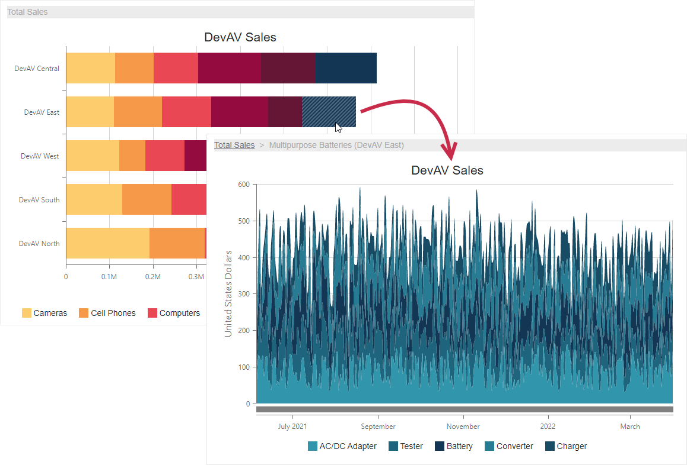

<!-- default badges list -->

<!-- default badges end -->
# Chart for Blazor - Create a Drill-Down Chart

You can create drill-down charts to visualize hierarchical data and allow users to explore its details. In this example, yearly product sales are distributed between company branches and product categories. Click bar series points, area series, and breadcrumb items to navigate detail levels.

The example uses a [template](https://docs.devexpress.com/Blazor/DevExpress.Blazor.DxChartCommonSeries-4.SeriesTemplate) to create series. The template is configured to apply individual settings to series types. Data fields that correspond to arguments and series names are passed as [expressions](https://docs.microsoft.com/en-us/dotnet/api/system.linq.expressions.expression?view=net-6.0) to obtain data for a specific detail level.

The example handles the [SeriesClick](https://docs.devexpress.com/Blazor/DevExpress.Blazor.DxChart-1.SeriesClick) and [onClick](https://www.w3schools.com/jsref/event_onclick.asp) events to respond to element clicks and switch between data detail levels. Depending on the level, the chart loads and displays corresponding data.

## Files to Review

- [Index.razor](CS/DrillDownChart/Pages/Index.razor)

## Documentation

- [DxChart](https://docs.devexpress.com/Blazor/DevExpress.Blazor.DxChart-1)
